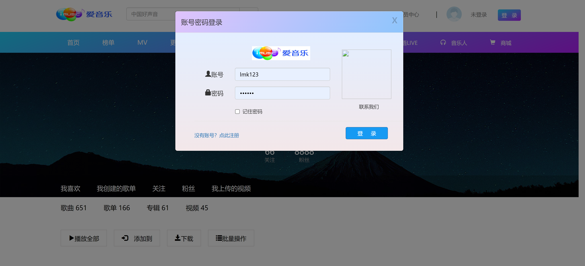

<h1 align="center">音乐管理系统</h1>

## 简介
音乐管理系统：功能包括主页、音乐库、播放列表、登录注册、个性化设置、排行榜、播放控制、歌曲分类推荐等，提供简洁界面和多样化音乐体验。    --计算机毕业设计源码；毕设源码；java毕业设计源码

## 联系方式

<h3 align="center">获取完整代码与数据库文件 + 微信：bysj5151 QQ: 86050149 QQ群: 783742310</h3>

<h3 align="center">可帮忙远程部署 包运行成功！提供远程部署、修改代码、设计文档指导、代码讲解等服务！</h3>

## 功能介绍（完整见运行截图）
管理员：基本功能包括用户登录、注册与密码管理，提供导航栏访问首页、音乐库、MV、用户设置等功能模块；管理音乐分类、播放列表及音乐资源，支持歌曲、歌手、专辑和排行榜维护，用户界面设计简洁实用。  
用户：可通过导航栏访问流行、热歌、新曲、经典分类音乐，浏览、搜索、播放音乐；创建、编辑自定义播放列表，查看歌曲信息及排行榜；个性化设置提供主题选择及账户管理，支持音乐的收藏、下载与分享。

## 运行截图

本代码来源于网络,仅供学习参考使用!

